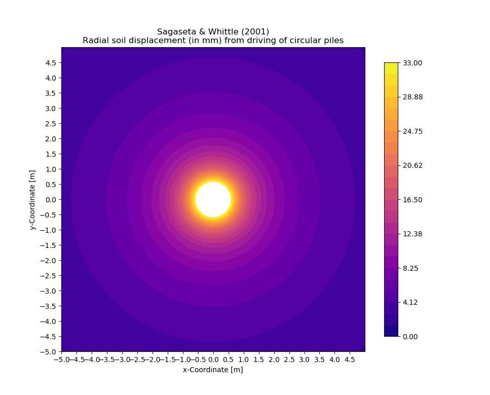

################
Project Gallery
################

********************************************************************************
Investigative Project at Batu Kawan, Pulau Pinang, Malaysia
********************************************************************************

.. raw:: html

    <iframe frameborder="0" width="100%" height="600px" src="Batu_Kawan.html">
   
    </iframe>

Project Summary
================

.. list-table::  
   :widths: 5 15
   :header-rows: 0

   * - **Client**
     - Chuan Un Chye (M) Sdn. Bhd.

   * - **Role of G&P Geotechnics**
     - Independent Geotechnical Consultant
        
   * - **Scope of Investigation**
     - On the probable causes of pile deviations observed from pre-cast RC square piles installed for the warehouse of Jabil Circuit Sdn. Bhd.

Pile Eccentricity from CUC
---------------------------------

.. figure:: CUC.png
      :align: center 
      :width: 1000 px
      :height: 500 px
      :class: no-scaled-link

Pile Eccentricity from Joint Survey
------------------------------------

.. figure:: Joint.png
      :align: center 
      :width: 1000 px
      :height: 500 px
      :class: no-scaled-link

Radial Soil Displacement from Pile Driving
---------------------------------------------

