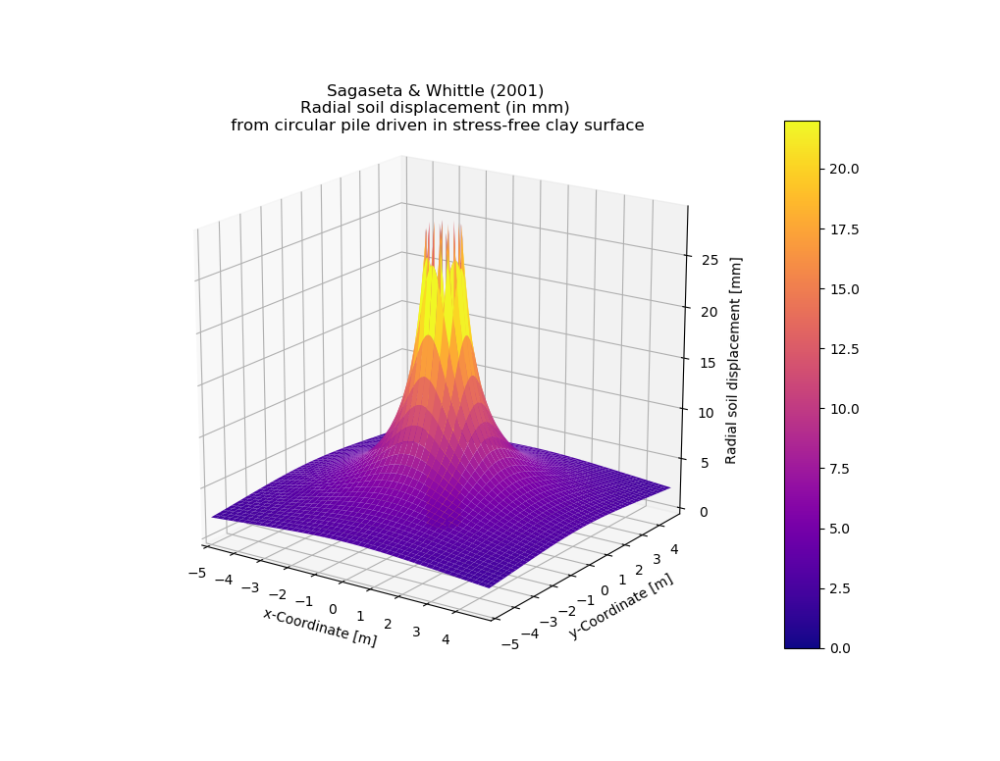

################
Project Gallery
################

********************************************************************************
Investigative Project at Batu Kawan, Pulau Pinang, Malaysia
********************************************************************************

.. raw:: html

    <iframe frameborder="0" width="100%" height="600px" src="Batu_Kawan.html">
   
    </iframe>

*****************
Project Summary
*****************

.. list-table::  
   :widths: 6 15
   :header-rows: 0

   * - **Client**
     - Chuan Un Chye (M) Sdn. Bhd. (*hereafter referred to as CUC*)

   * - **Role of G&P Geotechnics**
     - Geotechnical Consultant for 
            * Independent Investigation
            * Expert Opinions
        
   * - **Scope of Investigation**
     - On the probable causes of pile deviations observed from jack-in RC square piles
            * | Installed for the warehouse of Jabil Circuit Sdn. Bhd. 
              | (as depicted in the map)

   * - **Problem Statement**
     - Discrepencies in pile deviations (up to 300 mm and more) were identified between:
            * First as-built survey by CUC 
                  * Taken from Jan 2019 to March 2019
                  * Simultaneously conducted with ongoing piling and earthworks on-site 
            * Second joint-survey by CUC and Building Main Contractor 
                  * Taken in June 2019 
                  * Conducted after the end of piling and earthworks

   * - **General Site Geology** [[#GMPP]_]
     - The site is underlain by alluvium of Quaternary age which consists of
            * Inter-layered sands, silts and clays
            * With origins from the fluviatile deposits in the main river valleys

   * - **Challenges to Investigation**
     - Root cause analysis with intepretation of massive datasets under a stringent 3-week timeline
            * Piling logs from 6,248 jack-in RC pilepoints
            * Pile test reports for more than 300 pilepoints (PIT, HSDPLT, MLT)

   * - **Programming Solutions**
     - Python was used predominantly in
            * Pile deviation data processing and visualisation 
            * | Analysis on theoretical radial soil displacement from pile driving in clay
              | (Sagaseta & Whittle, 2001) [[#SSPM]_]
   
   * - **Project Team Members**
     - Team Structure 
            * Ir. Liew Shaw Shong (Project Director)
            * Chee Fong Wah (Project Engineer)
            * Teo Yow Yang (Engineer)
            * Ch'ng Wei En (Engineer)
            * Neoh Xiao Binn (Engineer)

**********************************
Data Visualisation with Python
**********************************
As-built Pile Deviation Data
==============================
Leveraging on Python's extensive data processing and visualisation capabilities:     
      * the as-built pile deviations were visualised in a spatial manner 

First As-built Pile Survey by CUC (Taken from Jan to March 2019)
==========================================================================================

.. figure:: CUC.png
      :align: center 
      :width: 1000 px
      :height: 500 px
      :class: no-scaled-link

Second Joint As-built Pile Survey (Taken in June 2019)
==========================================================================================

.. figure:: Joint.png
      :align: center 
      :width: 1000 px
      :height: 500 px
      :class: no-scaled-link

Key Observations from Python Data Visualisation
==========================================================================================

* Large pile clusters have greater pile deviations after installation.
      * Relative to smaller pile clusters (pilegroups of 3 and below). 

* Internal pile clusters have lesser cummulative movements in the second joint-survey taken in June 2019.
      * Compared to the first survey taken 3 months prior. 

* External pile clusters tend to have greater pile movements towards site boundary.
      * While the pile movements for internal pile clusters are more restrained.

Inferences from Python Data Visualisation
==========================================================================================
The observations were crucial to illustrate that the discrepancies in as-built pile deviation surveys were influenced by:

.. list-table::  
   :widths: 6 30
   :header-rows: 0

   * - **Spatial Factors**
     - Distribution of piles per unit area (*pile density*)
            * Radial soil displacement from pile jacking in clay as a function of *pile density*

   * - **Temporal Factor**
     - Timing of as-built pile deviation survey taken 
            * At least 3 months apart between the first and second surveys

***************************************
Theoretical Analysis with Python
***************************************

Radial Soil Displacement from Pile Driving or Jacking in Clay
===================================================================
| The phenomenon of radial soil displacement was further studied using Python with reference to 
| Sagaseta & Whittle (2001) [[#SSPM]_].

This theoretical study provided the project team insights into 
      * The expected displacement of clay due to hydraulic jacking circular piles.

| The radial soil displacement, at r > 3R \ :sub:`pile`\  of a 350mm diameter circular pile that is driven 30m into stress-free clay surface can be determined from the **Small Strain Path Method**

.. figure:: Python.png
      :align: center 
      :width: 200 px
      :height: 80 px
      :class: no-scaled-link

****************
Recommendations
****************
Facing an avalanche of piling data from over 6,000 piles, the use of Python assisted the project team greatly in 
      * Accelerating engineering analysis
      * Automating data visualisation.

However, it is should be stressed that Python and any other programming languages should only be used as a 
      * **Complementary tool** to automate repetive work flows.

Manual review of automated coding results **must be carried out** to ensure 
      * Sound and sensible engineering outputs.

**************
References
**************
.. [#GMPP]

| Geological Map of Pulau Pinang and Butterworth Area, New Series L7010 Sheet 28, Pulau Pinang (2014)
| Director General, Minerals and Geoscience Department of Malaysia

.. [#SSPM]

| Sagaseta, C. & Whittle, A. J. (2001), Prediction of Ground Movement due to Pile Driving in Clay
| `American Society of Civil Engineers, Journal of Geotechnical and Geoenvironmental Engineering, Vol 127 (1) <https://ascelibrary.org/doi/10.1061/%28ASCE%291090-0241%282001%29127%3A1%2855%29>`_
